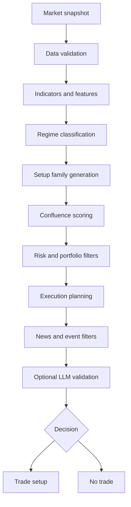
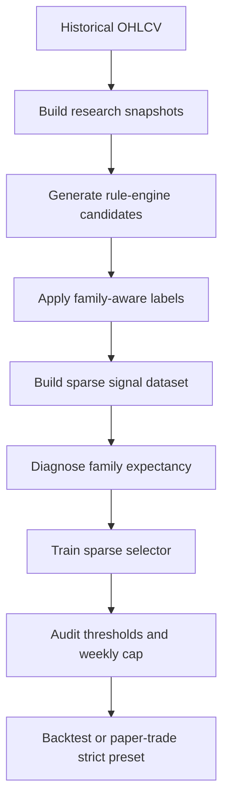
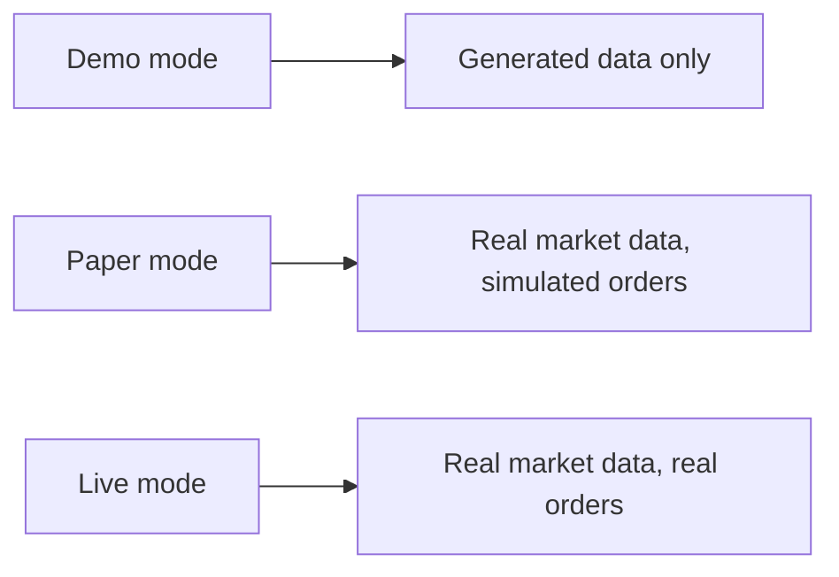

# AI Trading Engine

[](https://www.python.org/)
[](#project-status)
[](#safety-model)

AI Trading Engine is a Python research and execution prototype for crypto trade setup generation, filtering, backtesting, and selective ML-based trade selection.

The project is currently focused on ETH/USDT 1h research. Its design preference is conservative: produce fewer, better-supported setups and choose `NO_TRADE` when evidence is weak.

## Contents

- [What It Does](#what-it-does)
- [Project Status](#project-status)
- [Architecture](#architecture)
- [Research Workflow](#research-workflow)
- [Quick Start](#quick-start)
- [Configuration](#configuration)
- [Common Commands](#common-commands)
- [Repository Layout](#repository-layout)
- [Generated Files](#generated-files)
- [Safety Model](#safety-model)
- [Development](#development)
- [Documentation](#documentation)
- [License](#license)

## What It Does

The engine evaluates market snapshots through a layered decision pipeline:

- validates candle and market data quality
- computes indicators and market structure features
- classifies market regime
- generates candidate trade setups by setup family
- scores confluence and applies risk filters
- plans execution style
- optionally validates the final decision with an LLM
- emits a trade setup or an explicit no-trade decision

The research stack then turns those engine-generated setups into labeled datasets, audits setup-family quality, trains sparse selector models, and compares rule-based, model-based, and oracle-style selection limits.

## Project Status

This repository is a research prototype moving toward production hardening.

Working today:

- core rule-based engine pipeline
- demo, paper, backtest, and strict preset entrypoints
- dense baseline dataset and model pipeline
- sparse engine-candidate dataset pipeline
- family-aware labels, diagnostics, and selector training
- ETH/USDT 1h local research workflow
- BTC/USDC 15m control workflow for selector experiments

Known limitations:

- the sparse selector currently abstains after calibration
- the ETH/USDT 1h candidate pool remains overall-negative under honest labels
- walk-forward validation is not fully implemented
- live execution wiring is not yet fully aligned with the sparse selector deployment path
- market-context features are still partly simplified historical proxies

See [docs/ROADMAP.md](docs/ROADMAP.md), [docs/KNOWN_ISSUES.md](docs/KNOWN_ISSUES.md), and [docs/research_upgrade_status.md](docs/research_upgrade_status.md) for the active research state.

## Architecture

### Engine Pipeline



### Research Pipeline



### Runtime Modes



## Research Workflow

The current selective-deployment workflow asks a practical question:

> Given the setups the engine can generate, which small number should be taken?

The sparse selector is intentionally different from a dense candle classifier. It does not force a long or short prediction on every candle. It trains only on engine-generated candidates and evaluates whether a small weekly trade budget can select higher-quality opportunities.

Recommended loop after candidate-rule changes:

1. Rebuild the sparse dataset.
2. Diagnose family expectancy and oracle limits.
3. Train or retrain the sparse selector.
4. Compare validation/test behavior under `weekly_cap=1` and `weekly_cap=10`.
5. Update the research notes if behavior changed.

```bash
make build-signal-dataset asset=ETH/USDT timeframe=1h
make diagnose-signal-dataset asset=ETH/USDT timeframe=1h weekly_cap=1
make diagnose-signal-dataset asset=ETH/USDT timeframe=1h weekly_cap=10
make train-signal asset=ETH/USDT timeframe=1h weekly_cap=10
```

## Quick Start

### 1. Clone and enter the project

```bash
git clone https://github.com/miladtm94/Algorithmic-Trading-Engine.git
cd Algorithmic-Trading-Engine
```

### 2. Create the environment

```bash
make setup
make install-ml
```

`make setup` creates `.venv`, installs core/dev/prod dependencies, and creates a local `.env` from `.env.example` when one does not already exist.

### 3. Run the demo

```bash
make run
```

Demo mode uses generated data and does not connect to an exchange.

### 4. Run tests

```bash
make test
```

## Configuration

Runtime configuration lives in `.env`.

The repository includes `.env.example` as a template. The real `.env` file is intentionally ignored by Git and should never be committed.

Important variables:

| Variable | Purpose |
| --- | --- |
| `TRADING_MODE` | `demo`, `paper`, or `live` |
| `DEFAULT_ASSET` | Default symbol, for example `ETH/USDT` |
| `DEFAULT_TIMEFRAME` | Default timeframe, for example `1h` |
| `EXCHANGE` | CCXT exchange id, for example `binance` |
| `EXCHANGE_API_KEY` | Optional exchange key |
| `EXCHANGE_API_SECRET` | Optional exchange secret |
| `EXCHANGE_SANDBOX` | Whether to use exchange sandbox/testnet support |
| `TELEGRAM_BOT_TOKEN` | Optional Telegram alert token |
| `TELEGRAM_CHAT_ID` | Optional Telegram destination |
| `OPENAI_API_KEY` | Optional LLM validation key |

## Common Commands

### Running

```bash
make run
make run-once
make run-paper
make run-paper-strict
```

### Backtesting

```bash
make backtest
make backtest-strict history_csv=data/historical/ETH_USDT_1h.csv
make backtest-history history_csv=data/historical/ETH_USDT_1h.csv preset=strict start=2024-10-01
```

### Dense Baseline Research

```bash
make fetch-history asset=ETH/USDT exchange=binance timeframe=1h years=2
make build-dataset asset=ETH/USDT timeframe=1h
make train asset=ETH/USDT timeframe=1h
make evaluate-at asset=ETH/USDT timeframe=1h at='2026-03-15 09:00'
```

### Sparse Signal Research

```bash
make build-signal-dataset asset=ETH/USDT timeframe=1h
make diagnose-signal-dataset asset=ETH/USDT timeframe=1h weekly_cap=1
make diagnose-signal-families asset=ETH/USDT timeframe=1h
make train-signal asset=ETH/USDT timeframe=1h
make evaluate-signal-at asset=ETH/USDT timeframe=1h at='2026-04-18 08:00'
```

### Quality

```bash
make lint
make typecheck
make test
```

### Git Publishing

```bash
make git-status
make git-remote
make git-commit-staged COMMIT_MSG="docs: polish public README and add license"
make git-push
```

Use `make git-commit-all COMMIT_MSG="..."` only when every visible local change should be included in the commit.

For a newly recreated remote repository that intentionally replaces previous remote history:

```bash
make git-push-force
```

`git-push-force` uses `--force-with-lease`, which is safer than a plain force push because it refuses to overwrite remote work that was updated unexpectedly.

## Repository Layout

```text
.
|-- Makefile
|-- pyproject.toml
|-- README.md
|-- docker-compose.yml
|-- docs/
|   |-- DECISIONS.md
|   |-- KNOWN_ISSUES.md
|   |-- ROADMAP.md
|   `-- research_upgrade_status.md
|-- scripts/
|   |-- backtest.py
|   |-- build_dataset.py
|   |-- build_signal_dataset.py
|   |-- diagnose_signal_dataset.py
|   |-- diagnose_signal_families.py
|   |-- evaluate_model.py
|   |-- evaluate_signal_model.py
|   |-- fetch_history.py
|   |-- train_model.py
|   `-- train_signal_model.py
|-- src/
|   `-- ai_trading_engine/
|       |-- __main__.py
|       |-- backtester.py
|       |-- dataset.py
|       |-- engine.py
|       |-- feature_extractor.py
|       |-- signal_generation.py
|       |-- signal_learning.py
|       `-- validation.py
`-- tests/
    |-- test_engine.py
    `-- test_research_pipeline.py
```

## Generated Files

The following local and generated artifacts are excluded from version control:

- `.env`
- `.env.*`
- `data/historical/*.csv`
- `data/features/*.csv`
- `data/models/`
- `data/reports/`
- `*.egg-info/`
- build, cache, and coverage outputs

Generated datasets, model artifacts, and reports should be regenerated locally or published separately as sanitized release assets when appropriate.

## Safety Model

This project is designed to be conservative by default:

- demo mode uses generated data only
- paper mode uses real market data with simulated execution
- live mode is explicit and should be treated as real-money trading
- `.env` and secret-like files are ignored by Git
- the strict preset limits eligible setup families and trade frequency
- the engine is allowed to abstain

Live trading should only be enabled after independent review, sandbox testing where supported, and manual verification of exchange permissions.

## Development

Install development tools:

```bash
make setup
make install-ml
```

Run the standard checks:

```bash
make lint
make typecheck
make test
```

The project is intentionally standard-library-first. Optional dependencies are grouped in `pyproject.toml`:

- `llm` for OpenAI validation
- `prod` for exchange connectivity and dotenv loading
- `ml` for scikit-learn and joblib
- `dev` for linting, typing, and tests

## Documentation

Additional project documentation is available in the `docs/` directory:

- [Roadmap](docs/ROADMAP.md): current implementation plan and research priorities
- [Design Decisions](docs/DECISIONS.md): architectural and product decisions
- [Known Issues](docs/KNOWN_ISSUES.md): limitations, risks, and open engineering work
- [Research Status](docs/research_upgrade_status.md): current selective-deployment research notes, diagnostics, and runbooks

These documents are intended to make the project auditable: research changes, validation assumptions, and deployment constraints are recorded alongside the code.

## License

This project is licensed under the [Apache License 2.0](LICENSE).

The Apache 2.0 license permits use, modification, and distribution under its stated terms, including preservation of copyright and license notices.

## Disclaimer

This repository is for software engineering and trading research. It does not provide financial advice, does not guarantee profitability, and should not be used with real funds without independent review, testing, and risk controls.
