# AI Trading Engine

[](https://www.python.org/)
[](#roadmap)
[](#license)

**A hybrid, institutional-style trading signal engine that combines quantitative models, rule-based risk controls, and optional LLM validation to produce risk-adjusted, execution-aware trade ideas.**

## Table of Contents

- [Overview](#overview)
- [Features](#features)
- [Architecture / How It Works](#architecture--how-it-works)
- [Tech Stack](#tech-stack)
- [Installation](#installation)
- [Usage](#usage)
- [Project Structure](#project-structure)
- [Screenshots / Demo](#screenshots--demo)
- [Performance / Benchmarks](#performance--benchmarks)
- [Roadmap](#roadmap)
- [Contributing](#contributing)
- [License](#license)
- [Author / Acknowledgements](#author--acknowledgements)

## Overview

`AI Trading Engine` is a modular Python trading framework designed to generate statistically grounded trading signals under explicit risk constraints. It evaluates market data through a multi-layer pipeline that validates inputs, classifies market regime, generates candidate setups, scores multi-factor confluence, enforces portfolio and execution rules, and optionally performs a final LLM-based consistency check before emitting a signal.

This project matters because most signal generators fail at the exact point that matters in production: risk realism. Instead of optimizing only for signal frequency, this engine prioritizes capital preservation, execution feasibility, and logical consistency. The result is a system that is useful both as a portfolio-ready prototype and as a strong foundation for research, backtesting, automation, and open-source collaboration.

Key differentiators:

- Combines quant indicators, structure analysis, execution filters, and contextual validation in a single decision engine
- Enforces hard constraints such as stop-loss requirement, confluence threshold, and minimum risk/reward
- Produces Telegram-ready trade outputs for rapid integration into monitoring or alerting workflows
- Keeps the architecture clean and extensible for live market data, backtesting, and bot deployment

## Features

- Validate market data across multiple sources and reject stale or inconsistent snapshots
- Classify market conditions into trend, range, and high-volatility regimes
- Generate candidate trades using EMA, VWAP, RSI, MACD, ATR, Bollinger Bands, structure, and order-book imbalance
- Score each setup with a weighted confluence model across trend, momentum, liquidity, structure, and sentiment
- Enforce portfolio-level protections including risk caps, correlation filtering, concurrent trade limits, and loss-based kill-switch logic
- Select execution style based on liquidity, spread, and breakout context
- Pause or reduce trading around high-impact macro or market-moving events
- Log completed trades and adapt factor weights for post-trade learning
- Support optional LLM validation for final consistency and contextual sanity checks

## Architecture / How It Works

The engine is organized as a layered decision pipeline. Each layer has a single responsibility, making the system easier to test, extend, and reason about.

```mermaid
flowchart LR
    A["Market Snapshot"] --> B["Data Validation"]
    B --> C["Indicator Computation"]
    C --> D["Regime Classification"]
    D --> E["Signal Generation"]
    E --> F["Confluence Scoring"]
    F --> G["Risk & Portfolio Filters"]
    G --> H["Execution Planning"]
    H --> I["Event / News Filter"]
    I --> J["LLM Validation (Optional)"]
    J --> K["Telegram-Ready Signal or No-Trade Decision"]
```



### Decision Flow

1. **Validate inputs**  
   Confirm candle integrity, timestamp freshness, and cross-source price consistency.

2. **Classify the market regime**  
   Detect whether the asset is trending, range-bound, or in a high-volatility state, then select the appropriate strategy bias.

3. **Generate a candidate trade**  
   Use technical indicators, price structure, and order-flow context to construct a long or short setup with entry, stop-loss, and targets.

4. **Score confluence**  
   Aggregate weighted evidence across trend alignment, momentum, volume/liquidity, structure, and sentiment.

5. **Apply risk and execution constraints**  
   Reject trades that violate portfolio rules, minimum risk/reward, depth requirements, spread limits, or estimated slippage tolerance.

6. **Run contextual validation**  
   Use event filters and optional LLM review to catch conflicting logic or elevated uncertainty before publishing a final signal.

## Tech Stack

### Core

- **Language:** Python 3.11+
- **Packaging:** `setuptools`, `pyproject.toml`
- **Testing:** `unittest`

### Trading Logic

- **Indicators:** EMA, VWAP, RSI, MACD, ATR, Bollinger Bands
- **Signal Inputs:** Market structure, support/resistance, liquidity context, order-book imbalance
- **Risk Engine:** Position sizing, correlation checks, risk caps, kill-switch logic

### Integrations

- **Messaging:** Telegram Bot API
- **LLM Validation:** OpenAI Python SDK (optional extra)

## Installation

### 1. Clone the repository

```bash
git clone https://github.com/miladtm94/AI-Trading-Engine.git
cd AI-Trading-Engine
```

### 2. Create and activate a virtual environment

```bash
python -m venv .venv
source .venv/bin/activate
```

### 3. Install the package

```bash
pip install -e .
```

### 4. Optional: enable LLM validation

```bash
pip install -e ".[llm]"
export OPENAI_API_KEY="<your_openai_api_key>"
```

### 5. Optional: configure Telegram delivery

```bash
export TELEGRAM_BOT_TOKEN="<your_bot_token>"
export TELEGRAM_CHAT_ID="<your_chat_id>"
```

## Usage

### Run the demo engine from the CLI

```bash
PYTHONPATH=src python -m ai_trading_engine --asset ETH/USDT
```

### Run with optional LLM validation

```bash
PYTHONPATH=src python -m ai_trading_engine --asset BTC/USDT --llm
```

### Send a demo signal to Telegram

```bash
PYTHONPATH=src python scripts/send_demo_signal.py
```

### Example output

```text
id="trading-signal"
📊 Asset: ETH/USDT
📈 Direction: SHORT

🧠 Market Regime: Trending Bearish → Trend Following

📊 Confluence Score: 79.7%

🔍 Signal Factors:
- EMA 20/50/200 bearish alignment
- MACD histogram negative
- RSI bearish momentum
- Volume expansion confirms sell-off
- Order book ask-side imbalance

💰 Trade Setup:
- Entry: 3,207.90
- Stop Loss: 3,230.61
- Take Profit:
  - TP1: 3,162.47
  - TP2: 3,139.76
  - TP3: 3,117.04
```

### Programmatic usage

```python
from ai_trading_engine import EngineConfig, HybridTradingEngine
from ai_trading_engine.demo_data import build_demo_portfolio, build_demo_snapshot
from ai_trading_engine.formatters import format_decision

engine = HybridTradingEngine(EngineConfig())
snapshot = build_demo_snapshot("ETH/USDT")
portfolio = build_demo_portfolio()

decision = engine.evaluate(snapshot, portfolio)
print(format_decision(decision))
```

## Project Structure

```text
AI-Trading-Engine/
├── pyproject.toml
├── README.md
├── scripts/
│   └── send_demo_signal.py
├── src/
│   └── ai_trading_engine/
│       ├── __main__.py
│       ├── config.py
│       ├── confluence.py
│       ├── data_validation.py
│       ├── demo_data.py
│       ├── engine.py
│       ├── execution.py
│       ├── formatters.py
│       ├── indicators.py
│       ├── learning.py
│       ├── llm_validation.py
│       ├── models.py
│       ├── news.py
│       ├── regime.py
│       ├── risk.py
│       ├── signal_generation.py
│       └── telegram_bot.py
└── tests/
    └── test_engine.py
```

## Screenshots / Demo

The current project is CLI-based. Running the engine produces structured signal output like the example shown in the [Usage](#usage) section above.

To generate a live signal output in your terminal:

```bash
PYTHONPATH=src python -m ai_trading_engine --asset BTC/USDT
```

To push a demo signal to Telegram:

```bash
PYTHONPATH=src python scripts/send_demo_signal.py
```

## Performance / Benchmarks

This repository does **not** make live trading or profitability claims. Performance evaluation is intentionally conservative at this stage.

Current engineering validation includes:

- Unit-tested trade and no-trade decision paths
- Deterministic risk enforcement before signal publication
- Confluence thresholding with minimum risk/reward constraints
- Execution feasibility checks using spread, depth, and slippage estimates

Planned benchmark categories:

- Historical backtest performance by asset and regime
- Signal precision and expectancy metrics
- Execution-quality analysis under varying liquidity conditions
- Regime classification accuracy and false-positive rates

## Roadmap

- Add live exchange adapters for market data and order-book ingestion
- Introduce historical backtesting and walk-forward validation
- Build portfolio analytics and strategy performance dashboards
- Support multi-asset scanning and ranked signal output
- Expand event ingestion with economic calendar and market news feeds
- Add persistent storage for trades, signals, and learning metrics
- Expose a formal API layer for service-based deployment
- Harden observability with structured logging and monitoring hooks

## Contributing

Contributions are welcome, especially in the areas of data engineering, quant research, execution modeling, and infrastructure.

Before opening a pull request:

1. Create a focused branch for your change.
2. Keep modules small, composable, and well documented.
3. Add or update tests for behavioral changes.
4. Run the local test suite before submitting:

```bash
PYTHONPATH=src python -m unittest discover -s tests -v
```

Recommended contribution areas:

- Exchange integrations
- Backtesting and simulation
- Risk modeling improvements
- Signal scoring research
- Documentation and examples

## License

This project is licensed under the [Apache License 2.0](LICENSE).

You are free to use, modify, and distribute this software under the terms of the Apache 2.0 license. See the `LICENSE` file for the full license text.

## Author / Acknowledgements

**Author:** [Milad TM](https://github.com/miladtm94)

Acknowledgements:

- Open-source Python ecosystem for packaging and testing foundations
- Telegram Bot API for lightweight delivery workflows
- OpenAI SDK for optional contextual validation support

---

Built for systematic trading research, execution realism, and production-minded signal delivery.
